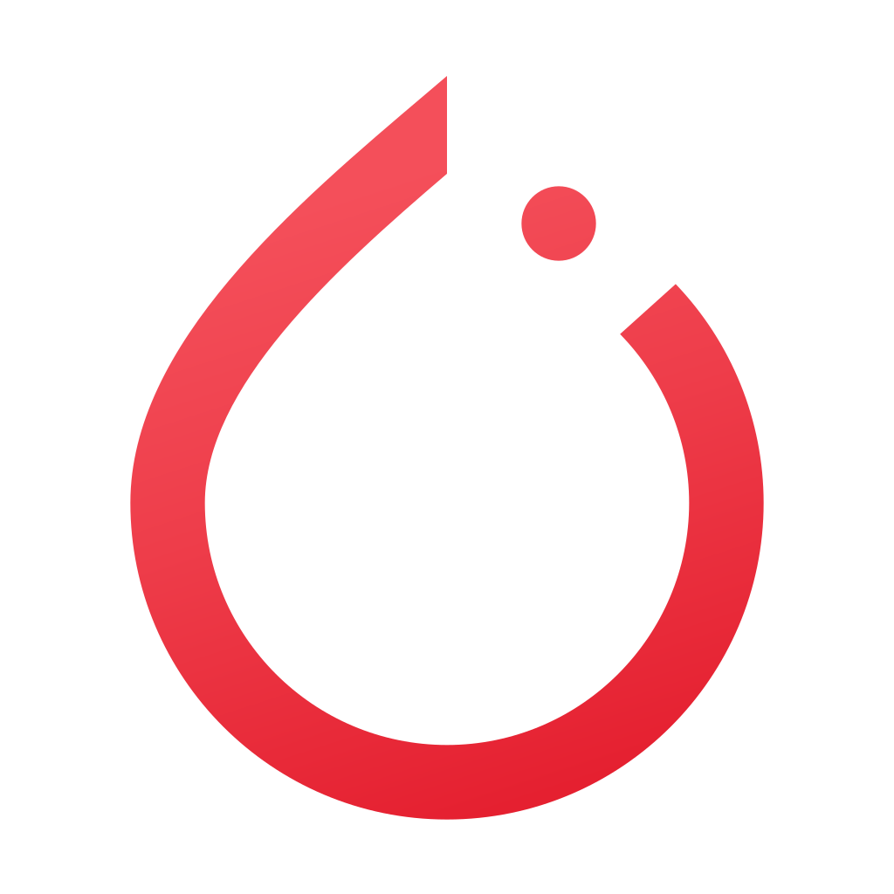
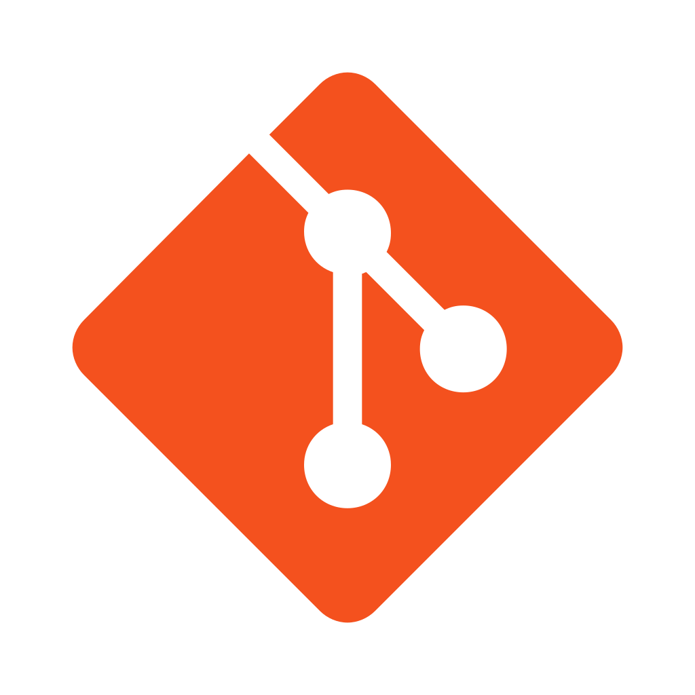
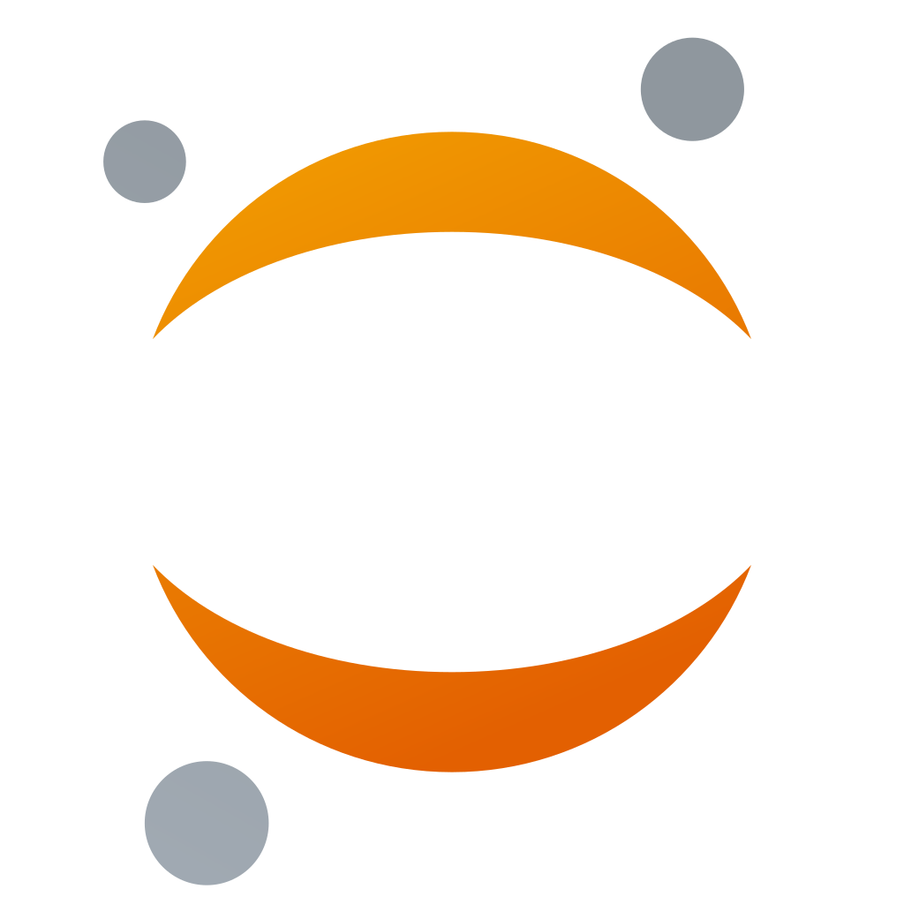

* 📊 I'm majoring in statistics.
* 💻 I'm studying Data Scienc.
* ⌨️ I'm currently studying Python development.

 

|  |  |  |  |  |  |  |
|:---:|:---:|:---:|:---:|:---:|:---:|:---:|

 

|| |  |  |  |
|:---:|:---:|:---:|:---:|:---:|
